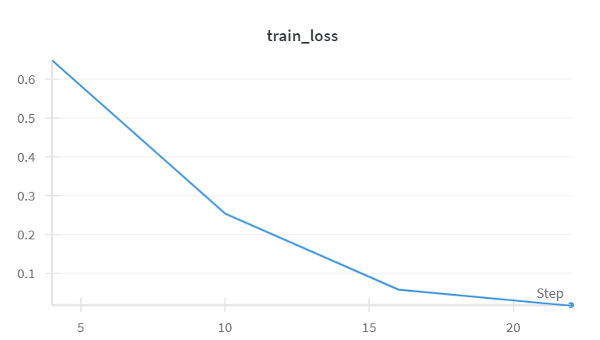
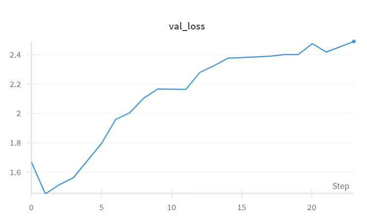
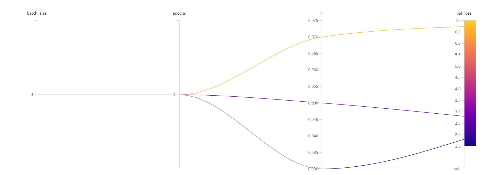
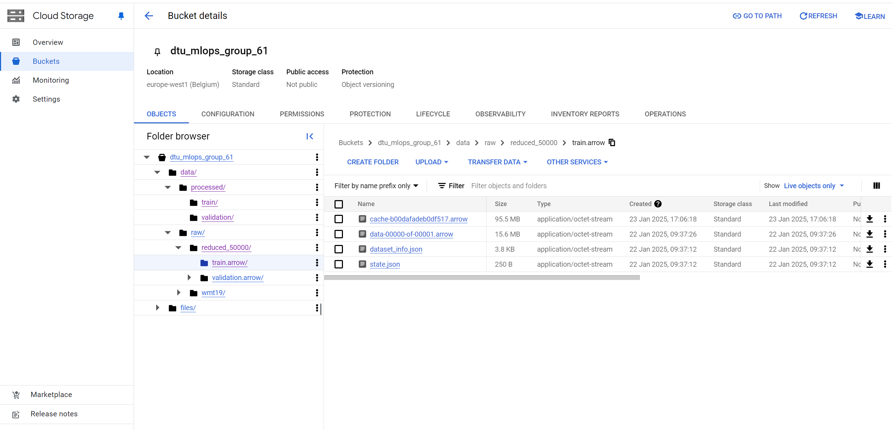
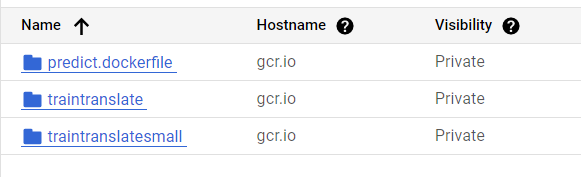
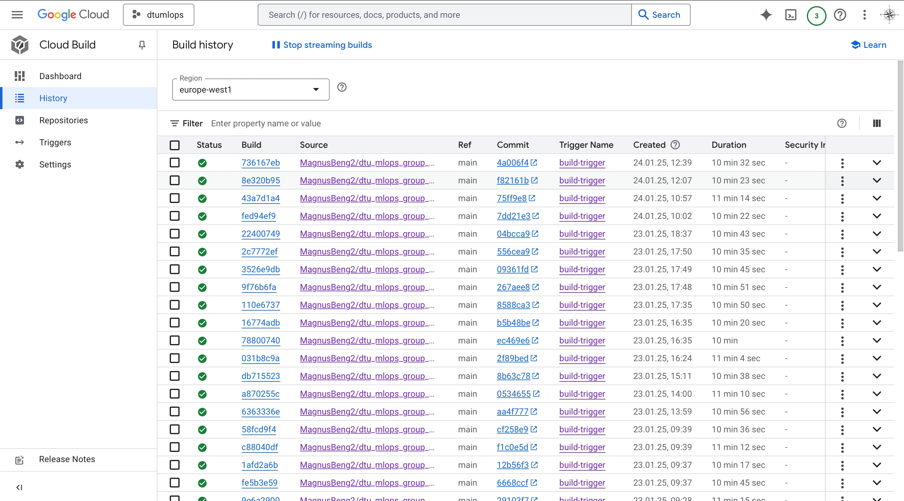
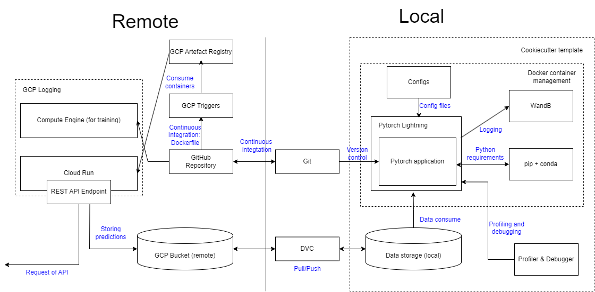

# Exam template for 02476 Machine Learning Operations

This is the report template for the exam. Please only remove the text formatted as with three dashes in front and behind
like:

```--- question 1 fill here ---```

where you instead should add your answers. Any other changes may have unwanted consequences when your report is auto
generated in the end of the course. For questions where you are asked to include images, start by adding the image to
the `figures` subfolder (please only use `.png`, `.jpg` or `.jpeg`) and then add the following code in your answer:

```markdown

```

In addition to this markdown file, we also provide the `report.py` script that provides two utility functions:

Running:

```bash
python report.py html
```

will generate an `.html` page of your report. After deadline for answering this template, we will autoscrape
everything in this `reports` folder and then use this utility to generate an `.html` page that will be your serve
as your final handin.

Running

```bash
python report.py check
```

will check your answers in this template against the constrains listed for each question e.g. is your answer too
short, too long, have you included an image when asked to.

For both functions to work it is important that you do not rename anything. The script have two dependencies that can
be installed with `pip install click markdown`.

## Group information

### Question 1
> **Enter the group number you signed up on <learn.inside.dtu.dk>**
>
> Answer:

61

### Question 2
> **Enter the study number for each member in the group**
>
> Answer:

214997, s215002, s216169

### Question 3
> **What framework did you choose to work with and did it help you complete the project?**
>
> Answer length: 100-200 words.
>
> Example:
> *We used the third-party framework ... in our project. We used functionality ... and functionality ... from the*
> *package to do ... and ... in our project*.
>s
> Answer:

In this project, we made use of the [Transformers](https://github.com/huggingface/transformers) library developed by the Huggingface team. This library includes the [t5-small model](https://huggingface.co/t5-small), a natural language processing (NLP) model designed for tasks like translating text between languages. For this project, we employed the Trainer class from the PyTorch Lightning framework to train and evaluate the t5-small model using a subset of the English/German (en-de) [WMT19 dataset](https://huggingface.co/datasets/wmt19), which originates from the Fourth Conference on Machine Translation. Additionally, we used Weights and Biases (`wandb`) to manage the configuration file containing the model's hyperparameters and to log the training and validation losses. Utilizing the obtained model and its parameters given for the best run, we were able to translate an input of English text to German.


## Coding environment

> In the following section we are interested in learning more about you local development environment.

### Question 4

> **Explain how you managed dependencies in your project? Explain the process a new team member would have to go**
> **through to get an exact copy of your environment.**
>
> Answer length: 100-200 words
>
> Example:
> *We used ... for managing our dependencies. The list of dependencies was auto-generated using ... . To get a*
> *complete copy of our development environment, one would have to run the following commands*
>
> Answer:

Initially, we established a new conda environment, called 'dtu_mlops_group_61', running Python 3.11. This would ensure that all users would be running on the same environment-type.

In the project, we used a requirements.txt file to keep track of the necessary python packages to run the project code. Some of python packages in requirements.txt require a specific version to be downloaded, as to prevent certain incompatibilities. The requirements.txt was created and filled in as the project progressed.


To get a complete copy of our development enviroment, one would have to run the following commands (assuming they have git installed):
```
git clone https://github.com/MagnusBeng2/dtu_mlops_group_61.git
cd ./dtu_mlops_exam_project
conda create -n dtu_mlops_group_61 python=3.11
pip install -r requirements.txt
dvc pull
pip install -e .
```

### Question 5

> **We expect that you initialized your project using the cookiecutter template. Explain the overall structure of your code. Did you fill out every folder or only a subset?**
>
> Answer length: 100-200 words
>
> Example:
> *From the cookiecutter template we have filled out the ... , ... and ... folder. We have removed the ... folder*
> *because we did not use any ... in our project. We have added an ... folder that contains ... for running our*
> *experiments.*
> Answer:

SKAL SKRIVES OM, IKKE VORES TEKST
The overall structure is initialized with the cookiecutter template. In general we tried to follow the cookiecutter structure as much as possible. Since the original WMT19 dataset took up too much memory in both cloud and drive, we processed the data locally and only included a subset in the proccessed folder in the data folder. Thus we deleted the data/external/, data/interim/ and data/raw/ folders. We also deleted the folders notebooks/, references/, src/features/, src/visualization/, since we did not use these. We filled out the src/data/ folder and the src/models/ folder in which we also included a file src/models/evaluate_model.py for evaluating the model and a folder src/models/config/, with the configuration files.
We also included the tests/ folder which holds scripts for conducting different pytests.


### Question 6

> **Did you implement any rules for code quality and format? Additionally, explain with your own words why these**
> **concepts matters in larger projects.**
>
> Answer length: 50-100 words.
>
> Answer:

Yes, in this project rules for quality and formatting was implemented using the ruff linter in our continuous integration. The ruff linter ensures compliance with PEP 8 standards, together with pre-commit hooks which automatically check and fix issues in the staged files before pushing. This includes trailing  whitespaces, missing newlines at the end of files and improperly sorted imports.


## Version control

> In the following section we are interested in how version control was used in your project during development to
> corporate and increase the quality of your code.

### Question 7

> **How many tests did you implement?**
>
> Answer:

5

### Question 8

> **What is the total code coverage (in percentage) of your code? If you code had a code coverage of 100% (or close**
> **to), would you still trust it to be error free? Explain you reasoning.**
>
> **Answer length: 100-200 words.**
>
> Example:
> *The total code coverage of code is X%, which includes all our source code. We are far from 100% coverage of our **
> *code and even if we were then...*
>
> Answer:

The reason for the code coverage being just lower than 100% in the file model.py is that lines 44 and 46 are related to edge-case checks in the _init_.py. These checks handle invalid configurations (e.g., missing or invalid parameters) that are not triggered in the current test setup, as we assumed valid configurations were always to be provided.

The code coverage being 45% for predict_model.py is:
1: the functionality for loading a checkpoint is not tested.
2. parts of the code that utilize external data files is not tested
3. the if _name_ == '_main_' is executed outside the pytest context
4. Command-line arguments aren't tested
5. Error handling, logging or sanity checks or not tested
Thus, we focused more on testing the core logic of the model.

The code coverage for train_model is merely 81% due to no testing of error handling and logging mechanisms. Instead, we focused on testing the core functionality of the argument parset, data loading and repoducibility.


### Question 9

> **Did your workflow include using branches and pull requests? If yes, explain how. If not, explain how branches and**
> **pull request can help improve version control.**
>
> Answer length: 100-200 words.
>
> Example:
> *We made use of both branches and PRs in our project. In our group, each member had a branch that they worked on in*
> *addition to the main branch. To merge code we ...*
>
> Answer:

We utilized two major branches in this project, main, which we used as the developer branch, and the safe branch, which we updated rarely, but only with working versions of the repository. This ensured that we kept the number of branches to a minimum, while still having flexibility and allowing for better error-handling.

Now, we did not for this protect have branch protection rules. In retrospect, it would probably be most advantageous to establish rules inside the GitHub repository, making sure that push and merge requests wouldn't simply override the wrong files. However, we believed it would add additional complexity to project and since we were only 4 group members, we decided upon refraining from using them. All group members made the pledge to ensure to pull new updates before pushing, always ensuring up-to-date repository and no merge conflicts.

That being said, it is definitely the practice to construct branch protection rules in one's repository, especially when being many developers work on it. For the future, it would be the best option to include branch protection rules for our future repositories.

### Question 10

> **Did you use DVC for managing data in your project? If yes, then how did it improve your project to have version**
> **control of your data. If no, explain a case where it would be beneficial to have version control of your data.**
>
> Answer length: 100-200 words.
>
> Example:
> *We did make use of DVC in the following way: ... . In the end it helped us in ... for controlling ... part of our*
> *pipeline*
>
> Answer:


SKAL SKRIVES OM, IKKE VORES TEKST
The wmt19 dataset originally contained around 9GB of data. Hence we decided to create a subset of the dataset. Data version control hereby contributed to an easy update of the data. We initially created a bucket in Google Cloud and used dvc to manage this. However s194333 did not have enough credit to sustain this service hence we had to create another bucket containing the same data with a different billing account. However we also stored the data on google drive, in case we potentially would use all credits on cloud again. Hence the dvc package proved to be very usefull for switching between different data storage options. In addition, dvc was an easy update to implement on all our devices since it only required some simple terminal commands.

### Question 11

> **Discuss your continues integration setup. What kind of CI are you running (unittesting, linting, etc.)? Do you test**
> **multiple operating systems, python version etc. Do you make use of caching? Feel free to insert a link to one of**
> **your github actions workflow.**
>
> Answer length: 200-300 words.
>
> Example:
> *We have organized our continues integration into 3 separate files: one for doing ..., one for running ... testing and one for running*
> *... . In particular for our ..., we used ... .An example of a triggered workflow can be seen here: <weblink>*
>
> Answer:

In this project we have implemented a continuous integration setup using the actions function in github. This includes unit testing and linting, for more than one operating system. To be more specific, the tests are run on python 3.12, and all 3 operating systems linux(ubuntu), macos, and windows. Unit testing is done using pytest, ... . For linting, Ruff is used as mentioned before replacing both flake8 and isort, adhering to python standards PEP8 and handling import, sorting and replacing. In the future mypy could be added as a way to perform static type checking.

Here is a link to the github actions:
https://github.com/MagnusBeng2/dtu_mlops_group_61/actions


## Running code and tracking experiments

> In the following section we are interested in learning more about the experimental setup for running your code and
> especially the reproducibility of your experiments.

### Question 12

> **How did you configure experiments? Did you make use of config files? Explain with coding examples of how you would**
> **run an experiment.**
>
> Answer length: 50-100 words.
>
> Example:
> *We used a simple argparser, that worked in the following way: python my_script.py --lr 1e-3 --batch_size 25*
>
> Answer:

For training the model, the chosen hyperparameters are by default taken from the python script's argparser. We found this to be easier than taking from a config file. However, we still inserted one under /src/models/config to show that it was also an option.

In the script, we set the default values in the argparsers, which could be simply overwritten when running the CLI command, like:
'python ./src/models/train_model.py' --epochs 10 --lr 0.01', signifying that this run should run with 10 epochs and a learning rate og 0.01. The argsparser passes either the default or selected values to the wandb.init() function, whereafter the hyperparameters are loaded into the training script as follows:

config = wandb.config
    lr = config.lr
    epochs = config.epochs
    batch_size = config.batch_size
    seed = config.seed

Moreover, we utilized the sweep functionality of WandB in sweep_model.py as to optimize hyperparameters, wherethrough the hyperparameter configuration was logged.

As for evaluate_model.py, it also utilized the argparsing functionality, taking the inputs 'seed', 'batch_size' and 'checkpoint_dir' for evaluation.

And for predict_model.py, it took an input and if the API was to be used, ultimately, translating the input into a text in German.

### Question 13

> **Reproducibility of experiments are important. Related to the last question, how did you secure that no information**
> **is lost when running experiments and that your experiments are reproducible?**
>
> Answer length: 100-200 words.
>
> Example:
> *We made use of config files. Whenever an experiment is run the following happens: ... . To reproduce an experiment*
> *one would have to do ...*
>
> Answer:


**SKAL SKRIVES OM**
When we load the config file the hyperparameters of the model is set to the values provided in the file. Hence one can easily see which parameters are used to train. However, when conducting experiments it is important to track which parameters are used. By ensuring commits between changes in config file we make sure that experiments are logged in the git commit history. In order to reproduce the experiments we included a seed in the configuration file. Hereby we ensure that the exact same results are obtained when training a model with a specific set of hyperparameters. Furthermore we created docker images, which ensures that our models can be run on all computers. By running multiple experiments in W&B we ensure that hyperparameters are kept in W&B.

### Question 14

> **Upload 1 to 3 screenshots that show the experiments that you have done in W&B (or another experiment tracking**
> **service of your choice). This may include loss graphs, logged images, hyperparameter sweeps etc. You can take**
> **inspiration from [this figure](figures/wandb.png). Explain what metrics you are tracking and why they are**
> **important.**
>
> Answer length: 200-300 words + 1 to 3 screenshots.
>
> Example:
> *As seen in the first image when have tracked ... and ... which both inform us about ... in our experiments.*
> *As seen in the second image we are also tracking ... and ...*
>
> Answer:

**SKAL SKRIVES OM**
In W&B we track the training loss as seen on the figure below.



We see a small descrease of the loss. This metric is essential for showing whether the model is learning from the data during the training.

We also track the validation loss as seen on the figure below.



The validation loss is very important to monitor the models performance when presented to unknown data.

We also perform a sweep in an attempt to optimize hyperparamters based on obtaining the lowest possible validation loss.



This did however show us that with the best hyperparameterse the validation loss remains constant.

### Question 15

> **Docker is an important tool for creating containerized applications. Explain how you used docker in your**
> **experiments? Include how you would run your docker images and include a link to one of your docker files.**
>
> Answer length: 100-200 words.
>
> Example:
> *For our project we developed several images: one for training, inference and deployment. For example to run the*
> *training docker image: `docker run trainer:latest lr=1e-3 batch_size=64`. Link to docker file: <weblink>*
>
> Answer:

**SKAL SKRIVES OM**
In our project, reproducablity is very important, hence we utilize Docker in order to ensure that the application can be run on all devices. Hence we created docker images for training and deploying the model. Since building docker images are a time consuming task, we prefred google cloud for building the dockerimages in cloud using a dockerfile and triggers. After being build the docker images are run using google cloud Run.
A link to the training docker file is provided in the following:
https://github.com/MikkelGodsk/dtu_mlops_exam_project/blob/main/trainer.dockerfile


### Question 16

> **When running into bugs while trying to run your experiments, how did you perform debugging? Additionally, did you**
> **try to profile your code or do you think it is already perfect?**
>
> Answer length: 100-200 words.
>
> Example:
> *Debugging method was dependent on group member. Some just used ... and others used ... . We did a single profiling*
> *run of our main code at some point that showed ...*
>
> Answer:

When we locally exectuted the code for testing, we typically used the --debug_mode in the input, meaning the datasize would be shrunk to 10% of the original size. When the code would outright produce errors when being run, we would debug either using Copilot or ChatGPT for error fixes and recommendations. Furthermore, we would typically also insert simple print statements, e.g., to check the size of tensors.

When we got it to run locally, first then could we begin to export the functionality to Google Cloud.

For profiling, we utilized the in-built tool from Pytorch Lightning to profile the training. However, we did not improve the coding based on the profiling, as we found it adequate in this project to just illustrate that profiling was possible. Nonetheless, the profiling did point us in directions on how to improve the code.

## Working in the cloud

> In the following section we would like to know more about your experience when developing in the cloud.

### Question 17

> **List all the GCP services that you made use of in your project and shortly explain what each service does?**
>
> Answer length: 50-200 words.
>
> Example:
> *We used the following two services: Engine and Bucket. Engine is used for... and Bucket is used for...*
>
> Answer:

**SKAL SKRIVES OM**
Buckets:
We used GCP buckets for initally storing the data. However we quickly ran out of credits and hence had to create a new bucket containg the same data but with a different billing account. Furthermore we also used buckets for storring checkpoints.

Build:
Images are build using cloud build.

Triggers:
In order to automatically build images triggers are used to connect the github repository to google cloud

Containers:
Images are stored in containers

Run:
Models are deployed using google Run

Vertex AI:
Training framework where we run the docker image


### Question 18

> **The backbone of GCP is the Compute engine. Explained how you made use of this service and what type of VMs**
> **you used?**
>
> Answer length: 50-100 words.
>
> Example:
> *We used the compute engine to run our ... . We used instances with the following hardware: ... and we started the*
> *using a custom container: ...*
>
> Answer:

**SKAL SKRIVES OM(Peter)**
In this project we did not utilize the Compute engine and used Vertex AI instead.

### Question 19

> **Insert 1-2 images of your GCP bucket, such that we can see what data you have stored in it.**
> **You can take inspiration from [this figure](figures/bucket.png).**
>
> Answer:

The bucket is depicted here:

Here, the bucket dtu_mlops_group_61 stores both the raw and the processed data, but this can also be done locally. In the raw folder, there is the original dataset, wmt19, and a reduced version, consisting of merely 50.000 samples.


### Question 20

> **Upload one image of your GCP container registry, such that we can see the different images that you have stored.**
> **You can take inspiration from [this figure](figures/registry.png).**
>
> Answer:

**SKAL SKRIVES OM(Peter)**



### Question 21

> **Upload one image of your GCP cloud build history, so we can see the history of the images that have been build in**
> **your project. You can take inspiration from [this figure](figures/build.png).**
>
> Answer:

**SKAL SKRIVES OM(Peter)**


### Question 22

> **Did you manage to deploy your model, either in locally or cloud? If not, describe why. If yes, describe how and**
> **preferably how you invoke your deployed service?**
>
> Answer length: 100-200 words.
>
> Example:
> *For deployment we wrapped our model into application using ... . We first tried locally serving the model, which*
> *worked. Afterwards we deployed it in the cloud, using ... . To invoke the service an user would call*
> *`curl -X POST -F "file=@file.json"<weburl>`*
>
> Answer:

**SKAL SKRIVES OM**
Deploying the model locally was quite straight forward. Inputs to the model can easily be given through the terminal. However deploying in google cloud caused a lot more complication. For deployment we wrapped our model into an application using FastAPI and used cloud run. We were heavily challenged by the fact that after training the model the checkpoint could not be saved to a bucket on cloud without authentication, which we did not manage to implement. Hence we did not use the finetuned model for deployment directly trough cloud.
We did however manage to finetune the model on the hypatia cluster at DTU and uploading a checkpoint to bucket, however we had issues with downloading he checkpoint from within the python code (again due to authentication issues). Given a little more time, it would have been easy to setup DVC such that the model weights would be store alongside the dataset, whence we should have been able to get the finetuned model to deploy.

In the training file, we used distributed data loading and multiple workers implemented through pytorch-lightning.

Link to our model:
https://translation-gcp-app-jc4crsqeca-lz.a.run.app/translate/How are you doing?


### Question 23

> **Did you manage to implement monitoring of your deployed model? If yes, explain how it works. If not, explain how**
> **monitoring would help the longevity of your application.**
>
> Answer length: 100-200 words.
>
> Example:
> *We did not manage to implement monitoring. We would like to have monitoring implemented such that over time we could*
> *measure ... and ... that would inform us about this ... behaviour of our application.*
>
> Answer:

We did not manage to implement monitoring in this project. We would like to have implented cloud monitoring of our deployed model, so that we could measure the model performance and make sure it runs as expected over time. This tracking could include metrics like accuracy and precission, or f1 score to possibly detect model performance decrease. Moreover, because we have a translation model, and if it starts producing incorrect outputs more frequently, it could indicate data drifting which these models are higly susceptible to.

### Question 24

> **How many credits did you end up using during the project and what service was most expensive?**
>
> Answer length: 25-100 words.
>
> Example:
> *Group member 1 used ..., Group member 2 used ..., in total ... credits was spend during development. The service*
> *costing the most was ... due to ...*
>
> Answer:

**Peter udfyld de sidste**
We had one group member whose credits we used troughout the project phase. S214497 used a total of ... euro ....

## Overall discussion of project

> In the following section we would like you to think about the general structure of your project.

### Question 25

> **Include a figure that describes the overall architecture of your system and what services that you make use of.**
> **You can take inspiration from [this figure](figures/overview.png). Additionally in your own words, explain the**
> **overall steps in figure.**
>
> Answer length: 200-400 words
>
> Example:
>
> *The starting point of the diagram is our local setup, where we integrated ... and ... and ... into our code.*
> *Whenever we commit code and push to github, it auto triggers ... and ... . From there the diagram shows ...*
>
> Answer:

**SKAL SKRIVES OM**

The starting point of the diagram is our local pytorch application, which we wrapped in the **pytorch lightning** framework. This served as the inital steps of creating the mlops pipeline. We version-controled our project using **git** via **Github**. A new environment can be initialized using either **Conda** or **pip**. We opted to use `pipreqs` for finding the package requirements of our project, which made for seamless instantiation of the projects *requirements.txt*. We utilized `wandb` in conjunction with **pytorch lightning** for logging the 'experiments'/ training of our *NLP* model. For training configuration `wandb` performed satisfactory, hence `hydra` was omited from this project. These are the essential parts which are contained into a **docker** container. Locally the project follows the codestructure of **Cookiecutter**.

In order to utilize the **GPC** git and dvc both provides a link from the local machine. Git furthermore enabled **Github actions** for testing the code before uploading to a remote storage. Using a **trigger** connected to the github repository we created **docker images** in **docker containers** in the cloud.

When training a dataset stored in a **GCP bucket** was utilized. Information sharing and version control of the dataset was handled by utilizing **dvc**. We interfaced with our application through **Cloud Run** by using the **Fast API** framework. Finally, we didn't utilize monitoring as we had plenty of work on our hands, trying to interface with and getting our model to run on cloud.

### Question 26

> **Discuss the overall struggles of the project. Where did you spend most time and what did you do to overcome these**
> **challenges?**
>
> Answer length: 200-400 words.
>
> Example:
> *The biggest challenges in the project was using ... tool to do ... . The reason for this was ...*
>
> Answer:

Generally, most of the group members did not have much experience in GitHub when working on a group project. This resulted in a mismatch of repository versions, which needed to be solved before moving on. Working with github, of course, took some time to get used to, but as the project went on, good working habits were established.

Initially, a lot of time was used on finding and understanding the nature of the data and how it was going to be processed. Hereafter, we would also spend a lot of time getting the different python scripts inside of src/models running and making it fit to the processed data. And naturally, introducing things like logging and WandB to the scripts to ensure they are operable with the different services.

**Peter skal skrive noget mere omrking struggles**

**SKAL SKRIVES OM**
Our first time consuming task was to download the data. This was downloaded from huggingface which took a long time. We also spent an excessive amount of time trying to train our model on cloud. Some main factors contributing to this issue, was our funding running short and having to authenticate multiple frameworks within a docker container. s194333 created the project on GCP, however she quickly (within 48 hours) ran short on funding (complementary of the course) due to operations ineracting with the *bucket* storing our data. We aren't entirely certain as to what depleted the grants, however this greatly restricted our work. From docker we needed to authenticate dvc, GCP, in addition to `wandb`. This proved tremendously cumbersome as the authentication requires certfication, which we would preferably avoid storing in the docker image. During this process we spent a lot of time debugging. Due to long building times errors didn't occur immediatly, which resulted in a lot of reapeated idle time.

In general most of the tools and frameworks were relativly new for us, which resulted in a lot of google searches and unknown errors. The exercises significantly prepared us for conducting the project, however we still had a lot to learn when making the project. This challenged us in many ways, however we ultimately managed to overcome these.

### Question 27

> **State the individual contributions of each team member. This is required information from DTU, because we need to**
> **make sure all members contributed actively to the project**
>
> Answer length: 50-200 words.
>
> Example:
> *Student sXXXXXX was in charge of developing of setting up the initial cookie cutter project and developing of the*
> *docker containers for training our applications.*
> *Student sXXXXXX was in charge of training our models in the cloud and deploying them afterwards.*
> *All members contributed to code by...*
>
> Answer:
During our project we used a google sheets to keep track of how far we were with each assignment. This made sure everybody knew what eachother was working on, and prevented unnescesarry work.

Everybody worked on setting up the project and filling out the package requirements. Moreover, part of out project was to ensure we were complying with good coding practices(pep8), and document important part of our code.

Student s214987 was in charge of

Student s215002 was in charge of workflows and continuous integration. This includes testing and and pre-commits to ensure a secure workflow.

Student s216169 was in charge of

Student s224190 wa in charge of
